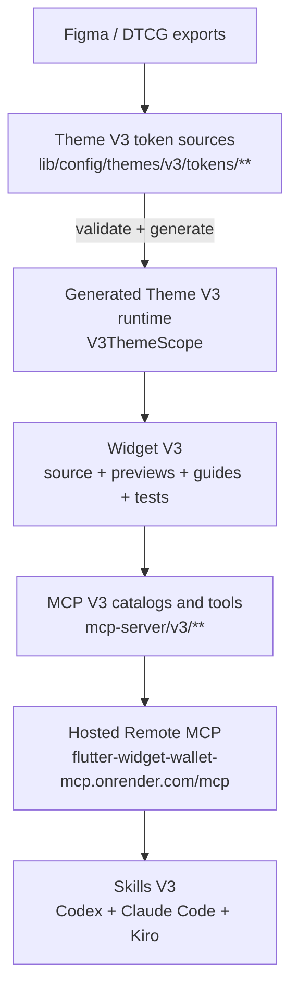
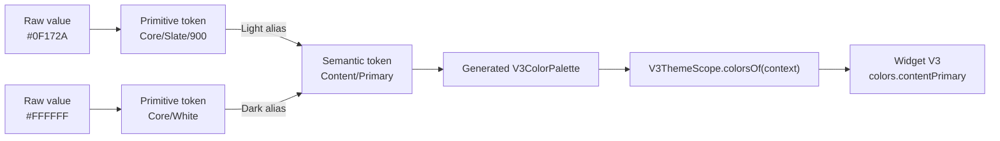
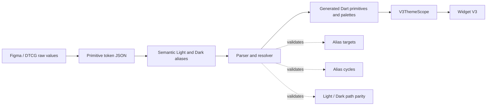
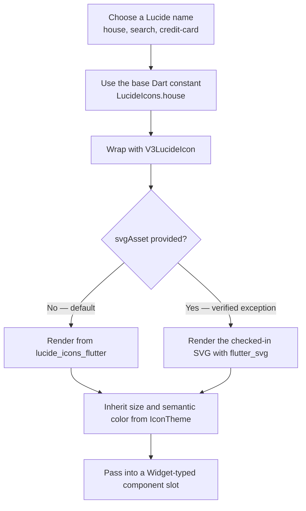

# Flutter Widget Library V3

[](https://dart.dev)
[](https://flutter.dev)
[](LICENSE)

A Flutter design-system and widget library for Finance, Wallet, and Banking products. The recommended path is **Theme V3 + Widget V3 + MCP V3 tools + Skills V3**, built from Figma/DTCG tokens with Light/Dark parity and distributed to AI agents through the existing hosted MCP service using Skills V3.

V3 is additive. The legacy theme, widgets, MCP contracts, and skills remain available for backward compatibility, but new development should use V3 paths, semantic tokens, V3-prefixed APIs, and Skills V3.

## Contents

- [V3 at a glance](#v3-at-a-glance)
- [Architecture](#architecture)
- [Repository structure](#repository-structure)
- [Quick start for repository contributors](#quick-start-for-repository-contributors)
- [Theme V3](#theme-v3)
- [Widget V3](#widget-v3)
- [V3 Lucide Icon](#v3-lucide-icon)
- [Remote MCP V3](#remote-mcp-v3)
- [Configure Remote MCP](#configure-remote-mcp)
- [Install Skills V3](#install-skills-v3)
- [Recommended agent workflow](#recommended-agent-workflow)
- [Localization and previews](#localization-and-previews)
- [Verification commands](#verification-commands)
- [Legacy compatibility](#legacy-compatibility)
- [Sources of truth](#sources-of-truth)

## V3 at a glance

The V3 stack is designed to move from Figma tokens to reusable Flutter components and agent-assisted delivery without duplicating design decisions:

- **Theme V3** — Figma/DTCG primitive and semantic tokens, deterministic Dart generation, Light/Dark parity, typography, spacing, radius, and shadows.
- **Widget V3** — isolated reusable widgets under `lib/widgets/v3/**` using `V3ThemeScope` and semantic tokens only.
- **MCP V3** — V3-prefixed tools for discovering the foundation, tokens, widgets, source, previews, metadata, patterns, and audit results.
- **Skills V3** — nine workflow skills for Codex, Claude Code, and Kiro covering onboarding, bootstrap, search, install, adapt, preview, Figma-to-code, audit, and upgrade.
- **Remote distribution** — one existing Render endpoint with Bearer authentication; no second V3 service or token set.

Current V3 pilot widget:

- `V3MiniButton` — Primary, Outline, and Ghost variants; Default, Active, Disabled, and Error states; icon slots; Light/Dark preview; tests and metadata.

## Architecture



## Repository structure

```text
lib/
├── config/themes/v3/         # Theme V3 sources, generator, runtime, generated output
├── widgets/v3/               # Widget V3 source, preview, and local metadata guides
├── config/themes/            # Legacy-stable theme system
├── widgets/                  # Legacy widgets plus the isolated v3/ subtree
├── l10n/                     # Localization source and generated ARB inputs
├── generated/intl/           # Generated localization Dart output
├── main.dart                 # Demo app entry
└── preview_v3/                # Local Widget V3 web preview host entry, routing, and registry

test/
├── config/themes/v3/         # Theme V3 parser, resolver, generation, and runtime tests
└── widgets/v3/               # Widget V3 tests

mcp-server/
├── v3/                       # V3 catalogs, contracts, handlers, and foundation allowlist
├── tests/                    # Legacy and V3 MCP regression coverage
└── scripts/                  # Local, HTTP, Render, and V3 verification scripts

skills-v3/
├── codex/.codex/skills/
├── claude-code/.claude/skills/
└── kiro/.kiro/skills/

docs/v3/                      # V3 conventions, reviews, onboarding, and validation evidence
task/V3_THEME_MCP_SKILLS_TASKS.md
```

## Quick start for repository contributors

### Requirements

- Dart SDK compatible with `^3.7.2`
- Flutter SDK compatible with the project Dart constraint
- Node.js `18+` for MCP and documentation tooling

### Install and run

```bash
flutter pub get
flutter run
```

Build and serve the Widget V3 local web preview host (one command, prints the exact URL once ready):

```bash
./scripts/serve-v3-preview.sh
# V3 preview ready: http://127.0.0.1:8090/#/button/V3MiniButton
```

Run any standalone widget preview directly:

```bash
flutter run \
  -t lib/widgets/v3/button/preview_v3_mini_button.dart \
  -d web-server \
  --web-hostname 127.0.0.1 \
  --web-port 8090
```

Run the MCP server locally over stdio:

```bash
cd mcp-server
npm ci
npm start
```

## Theme V3

Theme V3 source files live under `lib/config/themes/v3/`.

### Source-of-truth rules

- Editable token inputs: `lib/config/themes/v3/tokens/**`
- Generated Dart output: `lib/config/themes/v3/generated/**`
- Generator: `lib/config/themes/v3/v3_theme_generator.dart`
- Runtime selector: `V3ThemeScope`
- Detailed guideline: `lib/config/themes/v3/V3_THEME_GUIDELINE.mdx`

Never edit generated V3 files manually. Change token inputs first, then regenerate:

```bash
dart run lib/config/themes/v3/v3_theme_generator.dart
```

### Understanding raw values, primitive tokens, and semantic tokens

The short mental model is:

```text
raw value → primitive token → semantic token → Widget V3
```

This is close to saying “raw value = hardcode, primitive = a named raw value, semantic = a semantically named primitive,” but there is an important distinction: a raw value is not automatically a problem. Raw values must exist somewhere as the source data of the token system. They become harmful hardcoding when application or widget code embeds them directly and bypasses the token layers.

| Layer | Question it answers | Example | Rule in Theme V3 |
|---|---|---|---|
| **Raw value** | “What is the literal value?” | `#0F172A`, `16`, `8px` | Valid inside editable token sources; do not repeat directly in Widget V3 code |
| **Primitive token** | “Which stable value in the design scale is this?” | `Core/Slate/900`, `Space/16`, `Radius/8` | Gives raw values consistent names and organizes them into reusable scales; it does not describe UI intent |
| **Semantic token** | “What job does this value perform?” | `Content/Primary`, `Background/Primary`, `Border/Focus` | Aliases a primitive by purpose and is the preferred API for widgets; the same semantic path may resolve to different primitives in Light and Dark modes |
| **Widget usage** | “Where is that design role consumed?” | `colors.contentPrimary` | Widget V3 reads semantic APIs through `V3ThemeScope`, never raw values or legacy theme access |

For example, `Core/Slate/900` tells us which color exists in the palette, but not where it should be used. `Content/Primary` tells us that the color is intended for primary foreground content. In Light mode it can alias `Core/Slate/900`; in Dark mode the same `Content/Primary` role can alias `Core/White`. The widget keeps using `colors.contentPrimary` in both modes and does not need theme-specific conditions.



The complete Theme V3 data flow also includes validation and code generation:



Why this layering matters:

- **Consistency** — changing one primitive updates every semantic role that intentionally references it.
- **Theme switching** — Light and Dark keep the same semantic API while resolving to different primitive values.
- **Design intent** — `contentPrimary` communicates purpose more clearly than `slate900` or `#0F172A`.
- **Safer refactoring** — widgets remain stable when the palette changes because they depend on roles, not literal colors.
- **Design-to-code traceability** — Figma/DTCG aliases, generated Dart output, and Flutter runtime usage can be validated as one chain.

Use this decision rule when writing Widget V3 code:

1. Look for an existing semantic token that matches the UI role.
2. If no semantic role exists, report the design-system gap instead of choosing a visually similar primitive or raw value.
3. Update the editable token source and regenerate when the design system intentionally introduces a new role.
4. Use a primitive directly only when the V3 design specification explicitly requires primitive access; this is an exception, not the default widget API.

### Semantic-first usage

Widget V3 code must use semantic tokens from `V3ThemeScope.colorsOf(context)` and V3 dimension/typography APIs. Do not import the legacy `theme_color.dart`, call `ThemeColors.get()`, or introduce raw design colors inside V3 widgets.

```dart
final colors = V3ThemeScope.colorsOf(context);

return Container(
  color: colors.backgroundPrimary,
  child: Text(
    'Title',
    style: TextStyle(color: colors.contentPrimary),
  ),
);
```

`V3ThemeScope` resolves the generated Light or Dark palette from `Theme.of(context).brightness` without changing the legacy `ThemeData` bootstrap.

## Widget V3

New widgets belong under:

```text
lib/widgets/v3/<category>/
├── v3_<widget>.dart
├── preview_v3_<widget>.dart
└── V3_<WIDGET>_GUIDE.md

test/widgets/v3/<category>/
└── v3_<widget>_test.dart
```

Every Widget V3 should provide:

- A `V3`-prefixed public class and explicit constructor API
- Semantic Theme V3 colors and dimensions
- Light/Dark-compatible behavior
- A standalone preview
- Targeted widget tests
- Accessibility-aware semantics, readable typography, and adequate interaction targets
- A local guide containing `V3 Metadata` and semantic-token dependencies

Read these before creating or changing a Widget V3:

- `lib/widgets/v3/V3_WIDGETS_CONTEXT.md`
- `docs/v3/V3_WIDGET_CONVENTIONS.md`
- `lib/config/themes/v3/V3_THEME_GUIDELINE.mdx`

## V3 Lucide Icon

`V3LucideIcon` is the Theme V3 adapter for using [Lucide](https://lucide.dev) icons without coupling every reusable component directly to the icon package. Components such as `V3Navigation` and `V3MiniButton` keep their icon properties typed as `Widget`/`Widget?`; callers provide a `V3LucideIcon` or any other suitable widget.

### The simple mental model



The two rendering paths mean:

- **Package renderer (default)** — call an icon from `lucide_icons_flutter`; no SVG file needs to be stored in the project.
- **SVG override (exception)** — render a specific SVG file checked into the project when the package output has a verified mismatch with Figma, such as an exact path or stroke requirement.

```dart
// Default: render the icon from lucide_icons_flutter.
const V3LucideIcon(
  LucideIcons.house,
  size: V3IconSize.medium,
  stroke: V3IconStroke.regular,
)

// Exception: use a checked-in SVG instead of the package glyph.
const V3LucideIcon(
  LucideIcons.scanLine,
  size: V3IconSize.large,
  svgAsset: 'lib/assets/icons/v3/lucide/scan-line.svg',
)
```

### Size and stroke roles

| Size role | Value | Typical use |
|---|---:|---|
| `V3IconSize.tiny` | 12px | Mini Button |
| `V3IconSize.small` | 16px | Compact controls |
| `V3IconSize.medium` | 24px | Standard and Navigation icons |
| `V3IconSize.large` | 32px | Primary actions such as Scan |

| Stroke role | Intent | Package family |
|---|---:|---|
| `V3IconStroke.thin` | ~1px | `Lucide100` |
| `V3IconStroke.light` | ~1.5px | `Lucide300` |
| `V3IconStroke.regular` | 2px | `Lucide` |
| `V3IconStroke.bold` | ~2.5px | `Lucide600` |

Color is intentionally not a `V3LucideIcon` constructor property. It flows from the nearest `IconTheme`, allowing a parent Widget V3 to apply semantic Light/Dark, selected, disabled, or error colors without hardcoding them in the icon.

Use an SVG override only after comparing the package renderer with the verified Figma source. Do not copy the complete Lucide SVG library into the repository. Each override must have a pinned upstream source/version, license record, and documented reason.

Detailed guide: `lib/widgets/v3/icon/V3_LUCIDE_ICON_GUIDE.md`

## Remote MCP V3

Hosted endpoint:

```text
https://flutter-widget-wallet-mcp.onrender.com/mcp
```

The endpoint uses Streamable HTTP and exposes legacy read-only tools plus V3 read-only tools. New integrations should call V3-prefixed tools only.

Key remote V3 tools:

- Foundation: `get_v3_design_system_info`, `get_v3_theme_foundation`
- Tokens: `list_v3_color_tokens`, `search_v3_color_tokens`, `get_v3_color_token`
- Widgets: `list_v3_categories`, `list_v3_widgets`, `search_v3_widgets`
- Source and metadata: `get_v3_widget_details`, `get_v3_widget_metadata`, `get_v3_widget_code`, `get_v3_widget_preview`
- Quality: `audit_v3_widget`
- Authoring guidance: `get_v3_flutter_widget_template`, `get_v3_codebase_patterns`, `get_v3_figma_to_flutter_mapping`

Remote MCP is intentionally read-only. Generation helpers remain local/stdio-only optimizations; agents author and write files locally in the target project after reading remote templates, tokens, metadata, source, and previews.

Public health and capability metadata:

```text
https://flutter-widget-wallet-mcp.onrender.com/health
https://flutter-widget-wallet-mcp.onrender.com/info
```

## Configure Remote MCP

The same endpoint and Bearer token provide access to legacy and V3 tools. There is no separate V3 URL or authentication scheme.

> **Bearer token access:** The Bearer token is private and is never published in this repository. Request it directly from **Niwat, the repository owner, only**. Never accept it from another source or share it in commits, chat messages, screenshots, documentation, or config examples.

### Codex

Set the private Bearer token in your environment:

```bash
export MCP_BEARER_TOKEN="<TOKEN_FROM_NIWAT>"
```

Configure the MCP server in Codex with the following URL and header:

```text
URL: https://flutter-widget-wallet-mcp.onrender.com/mcp
Header: "Authorization: Bearer ${MCP_BEARER_TOKEN}"
```

### Claude Code

```bash
export MCP_BEARER_TOKEN="<TOKEN_FROM_NIWAT>"

claude mcp add --transport http flutter-widget-wallet-mcp \
  https://flutter-widget-wallet-mcp.onrender.com/mcp \
  --header "Authorization: Bearer ${MCP_BEARER_TOKEN}"
```

### Kiro and generic MCP clients

Use the generic Streamable HTTP configuration shape supported by the client:

```json
{
  "mcpServers": {
    "flutter-widget-wallet-mcp": {
      "url": "https://flutter-widget-wallet-mcp.onrender.com/mcp",
      "headers": {
        "Authorization": "Bearer <TOKEN_FROM_NIWAT>"
      }
    }
  }
}
```

Prefer environment-backed headers when the client supports them. The repository reference is `mcp-server/examples/remote.generic.mcp.json`.

## Install Skills V3

Skills V3 turn the Design System V3 catalog into guided, repeatable delivery workflows for AI coding agents. Instead of copying an isolated Dart snippet, an agent can inspect the target workspace, find the closest V3 component, retrieve its source and semantic-token requirements through MCP, install it with previews and tests, adapt it to the host project, and verify the result without falling back to the legacy theme.

Use Skills V3 for both ends of the adoption journey:

- **Learn the system before changing code** — use the read-only onboarding skill to understand Theme V3, design tokens, Widget V3, Lucide icons, previews, Remote MCP, and which implementation skill should run next.
- **Start a new Flutter project** — bootstrap a new app, install the Theme V3 runtime foundation, add a starter Widget V3, wire Light/Dark themes, create a standalone preview and tests, then run `flutter analyze` and `flutter test`.
- **Adopt V3 in an existing Flutter project** — scan the existing architecture, preserve the current app and legacy widgets, install selected components under `lib/widgets/v3/**`, adapt them to the project's own `V3ThemeScope`, and integrate them into the UI through an explicitly confirmed change scope.
- **Work from a selected UI element** — when an IDE, Flutter Inspector, Dart tooling, or agent host can provide the selected widget's class, source file, line, or widget-tree context, use that selection as the exact integration target. The agent can identify the intended role of the selected element, search for a matching Widget V3, show a live preview, install and adapt it, then replace or compose it at that location after confirmation.
- **Move from Figma to working Flutter UI** — map design intent to existing Widget V3 components first, then create a new semantic-token-based component only when the catalog has no suitable match.
- **Maintain imported components** — audit Theme V3 compliance, detect raw colors or legacy theme leakage, compare local code with the latest MCP source, and selectively upgrade without discarding intentional product-specific customization.

### Install the native skill pack

Connect Remote MCP first, then copy the native Skills V3 pack into the target project.

### Codex

```bash
cp -r skills-v3/codex/.codex <TARGET_PROJECT_ROOT>/
```

### Claude Code

```bash
cp -r skills-v3/claude-code/.claude <TARGET_PROJECT_ROOT>/
```

### Kiro

```bash
cp -r skills-v3/kiro/.kiro <TARGET_PROJECT_ROOT>/
```

### What each Skill V3 does

| Skill | Use it when | What it can do |
|---|---|---|
| `flutter-widget-v3-onboard` | You are new to the system or need to choose the correct V3 workflow | Explains the complete V3 architecture in the user's language, performs an optional read-only workspace orientation, links the relevant Wiki/source, and recommends the smallest next skill without changing files |
| `flutter-widget-v3-beginner` | You are starting a new Flutter app, or an existing app has not adopted Theme V3 yet | Classifies the workspace, proposes a safe scope, creates a confirmed new Flutter project when requested, installs the allowlisted Theme V3 runtime, adds a starter widget, preview and tests, and verifies Light/Dark behavior |
| `flutter-widget-v3-search` | You know the UI intent but not the component name | Searches by category, keyword, behavior or design intent; compares the best candidates, semantic-token dependencies, preview availability and expected adaptation effort |
| `flutter-widget-v3-install` | You have chosen a Widget V3 and want it in the current project | Retrieves metadata, Dart source and preview from MCP; installs the component into V3 paths; rewires it to the target project's `V3ThemeScope`; adds or refreshes its guide and targeted tests |
| `flutter-widget-v3-adapt` | An imported component works but does not yet feel native to the host app | Aligns imports, constructor shape, naming, semantic tokens, preview data and code patterns with the target project's Theme V3 foundation while preserving behavior |
| `flutter-widget-v3-preview` | You want to inspect a component before or after integration | Opens a readiness-checked live browser preview with Light/Dark coverage; outside the source repo it can use the published Flutter Web bundle without installing Flutter or writing into the consumer workspace |
| `flutter-widget-v3-figma-to-code` | You have a Figma component or structured handoff | Checks for reusable V3 components first, maps Figma values to semantic tokens, scaffolds a new V3-prefixed widget only when necessary, and hands the result to preview and validation workflows |
| `flutter-widget-v3-audit` | You want a quality review after installation or adaptation | Detects legacy theme imports, raw `Color(...)` values, missing `V3ThemeScope`, preview, metadata or tests; prioritizes findings and can apply explicitly requested safe fixes |
| `flutter-widget-v3-upgrade` | A locally imported Widget V3 may be behind the current library source | Compares local code, metadata and preview with MCP, separates upstream improvements from local customization and breaking changes, then performs a selective upgrade |

### Use case: create a new Flutter project

Start with `flutter-widget-v3-beginner` in confirmed `bootstrap-new` mode. The skill follows the mandatory `ask → scan → summarize → confirm → execute` flow, collects the project name, destination, organization and target platforms, checks that the destination is safe, runs `flutter create`, installs the Theme V3 foundation, adds a starter component with preview and tests, and runs verification.

Example request:

```text
Use flutter-widget-v3-beginner to create a new Flutter app named wallet_demo
for Android, iOS, and Web. Install Theme V3 and add a starter V3 button.
Show me the proposed files and wait for confirmation before making changes.
```

### Use case: import Widget V3 into an existing Flutter UI

For an existing project, combine the skills as a pipeline:

```text
search → preview → install → adapt → audit
```

1. Use `flutter-widget-v3-search` to find the closest component for the intended UI behavior.
2. Use `flutter-widget-v3-preview` to inspect its states and Light/Dark appearance before changing the app.
3. Use `flutter-widget-v3-beginner` first if the project does not yet have Theme V3; otherwise use `flutter-widget-v3-install` to bring in the selected source, preview, guide and tests.
4. Use `flutter-widget-v3-adapt` to align the component with the host project's semantic tokens and conventions.
5. Integrate the component into the requested screen only after confirming the target file and change scope, then use `flutter-widget-v3-audit` to check the completed integration.

Example request:

```text
Scan this existing Flutter project and find a Widget V3 for the primary action
in the checkout footer. Preview the best candidates first. After I confirm one,
install and adapt it to the existing Theme V3, then replace only that action.
Preserve the current business logic and callbacks.
```

### Use case: target an element selected with Flutter Inspector or Dart tooling

Inspector-assisted work makes the integration target more precise. Select the element in Flutter Inspector, DevTools, an IDE widget tree, or another Dart-aware inspection tool, then provide the agent with the available selection context: widget class, source path, line number, parent/child context, current props and the desired behavior.

```text
Selected element: CheckoutFooter > ElevatedButton
Source: lib/features/checkout/presentation/checkout_page.dart
Intent: replace this visual component with the closest Primary Widget V3 button
Constraint: preserve onPressed, loading state, analytics, and surrounding layout
Flow: search → preview → confirm → install → adapt → integrate → audit
```

The inspector supplies context; Skills V3 do not control Flutter Inspector directly. Component source remains under `lib/widgets/v3/**`. Editing an application screen outside V3 paths is a separate integration action and must be explicitly included in the confirmed scope, so selecting an element never silently authorizes unrelated UI changes.

Canonical specification: `docs/v3/V3_SKILLS_SPEC.md`

## Recommended agent workflow

1. Read the nearest `AGENTS.md` and `MEMORY.md`.
2. Connect to the existing Remote MCP endpoint.
3. Install the native Skills V3 pack for the agent.
4. Use `flutter-widget-v3-search` before building anything new.
5. Install or author only under V3 theme/widget/test paths.
6. Use semantic tokens through `V3ThemeScope`; never fall back to the legacy theme.
7. Keep standalone previews, Light/Dark coverage, tests, and local metadata guides aligned.
8. Run the narrowest relevant verification, then broader regression gates when required.

The mandatory beginner workflow is:

```text
ask → scan → summarize → confirm → execute
```

No files should be changed before the user confirms the proposed bootstrap scope.

## Localization and previews

Localization source of truth:

```text
lib/l10n/localization.json
```

Generated ARB and localization Dart files must not be edited manually.

```bash
dart run tool/generate_arb.dart
flutter gen-l10n
```

Supported locales:

- English (`en`)
- Thai (`th`)
- Chinese (`zh`)
- Russian (`ru`)
- Myanmar (`my`)

Preview options:

- Widget V3 local web preview host: `./scripts/serve-v3-preview.sh` (builds/serves `lib/preview_v3/main.dart`, prints the exact `http://127.0.0.1:8090/#/<category>/<WidgetClass>` URL once ready)
- Standalone Widget V3 (single widget, direct debug entrypoint): `flutter run -t lib/widgets/v3/<category>/preview_v3_<widget>.dart -d <device>`
- Browser preview: add `-d web-server --web-hostname 127.0.0.1 --web-port <port>`

New Widget V3 previews are discovered from `lib/widgets/v3/**/preview_v3_*.dart`. Run `dart run tool/generate_v3_preview_registry.dart` after adding or renaming one; never hand-edit `lib/preview_v3/preview_registry.g.dart`.

## Verification commands

### Flutter and V3 boundaries

```bash
flutter analyze
flutter test
npm run check:v3-boundaries
npm run test:v3-boundaries
npm run validate:v3-skills
```

### MCP local and hosted transport

```bash
cd mcp-server
npm ci
npm run check:mcp-syntax
npm test
npm run verify:mcp
npm run verify:mcp:http
```

### Deployed Render endpoint

Remote verification requires a valid private Bearer token:

```bash
cd mcp-server

MCP_REMOTE_BASE_URL="https://flutter-widget-wallet-mcp.onrender.com/mcp" \
MCP_REMOTE_BEARER_TOKEN="${MCP_BEARER_TOKEN}" \
npm run verify:mcp:remote

MCP_REMOTE_BASE_URL="https://flutter-widget-wallet-mcp.onrender.com/mcp" \
MCP_REMOTE_BEARER_TOKEN="${MCP_BEARER_TOKEN}" \
npm run verify:mcp:remote:v3
```

## Legacy compatibility

V3 does not replace or silently migrate the legacy system:

- Legacy theme files under `lib/config/themes/` remain stable.
- Legacy widgets outside `lib/widgets/v3/` remain supported and are not migrated automatically.
- Legacy MCP tool names, schemas, response fields, and error behavior remain protected by regression tests.
- Legacy skills under `skills/**` remain unchanged; V3 skills live separately under `skills-v3/**`.
- Existing MCP integration files change only additively when registering V3 tools.
- Remote generation/write tools remain excluded.

New implementation work should use V3 unless a task explicitly targets legacy compatibility or maintenance.

## Sources of truth

Read sources in this order when they disagree:

1. `AGENTS.md`
2. `MEMORY.md`
3. Live source code and build scripts
4. Widget-local V3 guide/context files
5. Broad overview documentation, including this README

Key V3 documents:

- Architecture: `docs/V3_THEME_MCP_SKILLS_PLAN.md`
- Execution status: `task/V3_THEME_MCP_SKILLS_TASKS.md`
- Theme guideline: `lib/config/themes/v3/V3_THEME_GUIDELINE.mdx`
- Widget creation context: `lib/widgets/v3/V3_WIDGETS_CONTEXT.md`
- Widget conventions: `docs/v3/V3_WIDGET_CONVENTIONS.md`
- Skills specification: `docs/v3/V3_SKILLS_SPEC.md`
- Remote onboarding: `docs/v3/V3_REMOTE_MCP_GUIDE.md`
- Review checklist: `docs/v3/V3_REVIEW_CHECKLIST.md`

Generated files such as localization output, Theme V3 generated Dart, and `docs/schema.json` must be regenerated from their source inputs rather than edited manually.
