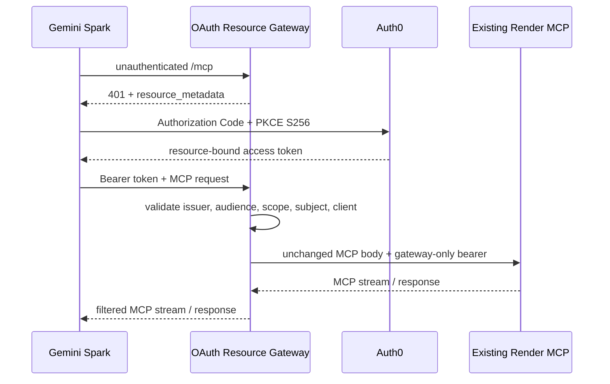

# Gemini Spark OAuth Gateway Security Record

## Data Flow

## Threat Model

| Threat | Control | Verification |
| --- | --- | --- |
| Forged or replayed access token | Auth0 JWKS signature, issuer/audience/expiry checks, short token lifetime | negative JWT tests |
| Token issued for another API | exact Gateway audience/resource check | wrong-audience test |
| Unauthorized account/client | subject and client allowlists | invalid identity tests |
| Cross-user MCP session reuse | bind `MCP-Session-Id` to issuer/subject/client tuple | cross-identity test |
| SSRF/open proxy | upstream origin and `/mcp` path are immutable server config | routing-control tests |
| Client credential reaches upstream | request header allowlist and dedicated bearer injection | header hygiene tests |
| Upstream bearer reaches client/log | response filtering and structured redaction | response/log tests |
| JSON-RPC semantic corruption | validate shape, then forward original bytes | byte-preservation test |
| Resource exhaustion | global + identity/IP rate limits, body limit, upstream timeout | limit/timeout tests |
| Browser cross-origin use | no CORS response headers by default | CORS test |
| Horizontal scaling breaks isolation | single-instance launch constraint | Render instance-count review |
| Authorization Server flaw | managed Auth0; no local `/authorize` or `/token` | route and source audit |

## Secret Ownership Matrix

| Secret/configuration | Stored by | Read by | Rotation owner | Forbidden destination |
| --- | --- | --- | --- | --- |
| Auth0 client secret | Auth0 + Gemini Spark credential UI | Gemini/Auth0 | Repository owner | Git, Gateway logs, existing MCP |
| Auth0 signing keys | Auth0 | Auth0; public JWKS read by Gateway | Auth0 | Repository |
| `GATEWAY_UPSTREAM_BEARER` | Render Gateway secret store + existing MCP bearer list | Gateway and existing MCP only | Repository owner | Gemini, Auth0, Git, logs |
| Existing user bearer tokens | Existing Render MCP secret store | Existing MCP only | Existing token owners | Gateway, Auth0, Git |
| `MCP_REMOTE_PROXY_SHARED_SECRET` | Existing Render MCP secret store | Existing trusted proxy flow only | Existing service owner | Gateway, Gemini, Auth0 |
| Auth0 issuer/audience/client IDs/subject IDs | Render Gateway configuration | Gateway | Repository owner | Not secrets; still redact subject IDs from public evidence |

## Evidence Redaction Rules

- Never archive bearer tokens, authorization codes, refresh tokens, cookies,
  client secrets, or full request bodies.
- Record only event type, timestamp, status, issuer host, hashed identity key,
  MCP method, latency, and redacted error category.
- Replace credentials in screenshots before committing evidence.
