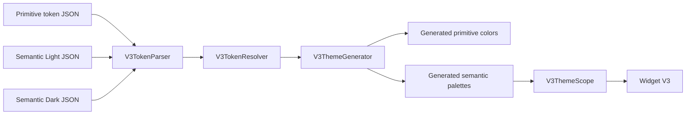

# Theme V3 Architecture Guideline

เอกสารนี้อธิบายโครงสร้าง หน้าที่ และการทำงานร่วมกันของทุกส่วนภายใน `lib/config/themes/v3/` สำหรับผู้พัฒนา ผู้ดูแล design system และ agent ที่ต้องเพิ่มหรือแก้ไข Theme V3

## ภาพรวม

Theme V3 เป็นระบบสีแบบ additive ซึ่งทำงานแยกจาก legacy theme จุดประสงค์หลักคือทำให้ Figma/DTCG token เป็น source of truth และให้ Flutter widget ใช้ semantic color API ที่รองรับ Light/Dark โดยอัตโนมัติ



กฎสำคัญ:

- แก้ไข token ที่ `tokens/**` เท่านั้น
- ห้ามแก้ไฟล์ `generated/**` ด้วยมือ
- Widget V3 ต้องใช้ semantic token ผ่าน `V3ThemeScope.colorsOf(context)`
- ห้าม import `theme_color.dart`, เรียก `ThemeColors.get()` หรือ fallback ไป legacy theme
- Light และ Dark ต้องมี semantic paths ชุดเดียวกัน

Widget ที่ consume Theme V3 ต้องทำตาม workflow, โครงสร้างไฟล์, preview, test และ metadata ใน [`../../../widgets/v3/V3_WIDGETS_CONTEXT.md`](../../../widgets/v3/V3_WIDGETS_CONTEXT.md) เอกสารทั้งสองเป็นคู่กัน: ไฟล์นี้กำหนด source/generation/runtime contract ของสี ส่วน Widget V3 Context กำหนดวิธีนำ semantic palette ไปสร้าง reusable widgets

## โครงสร้าง Directory

```text
lib/config/themes/v3/
├── README.md
├── V3_THEME_GUIDELINE.mdx
├── tokens/
│   ├── primitive.tokens.json
│   └── semantic/
│       ├── light.tokens.json
│       └── dark.tokens.json
├── generated/
│   ├── v3_primitive_colors.g.dart
│   └── v3_semantic_colors.g.dart
├── v3_color_token.dart
├── v3_token_parser.dart
├── v3_token_resolver.dart
├── v3_theme_generator.dart
├── v3_color_palette.dart
└── v3_theme_scope.dart
```

## เอกสารใน Root

### `README.md`

Quick start ของ Theme V3 ใช้สำหรับดู source-of-truth rules, ตัวอย่าง API, คำสั่ง generate และคำสั่งทดสอบแบบสั้น

### `V3_THEME_GUIDELINE.mdx`

เอกสารฉบับนี้เป็น architecture และ maintenance guide อธิบาย ownership ของทุกไฟล์ การไหลของข้อมูล รูปแบบ token วิธีพัฒนา และ failure modes ที่สำคัญ

## Token Sources

### `tokens/primitive.tokens.json`

Editable source สำหรับ primitive color จาก Figma จำนวน 145 รายการ เช่น `Slate/950`, `Blue/50`, `White` และ `Navy/600`

Primitive token ตอบคำถามว่า “ค่าสีจริงคืออะไร” จึงเก็บข้อมูลระดับ raw color ได้แก่:

- `$type: "color"`
- `$value.hex`
- `$value.alpha`
- `$value.colorSpace`
- `$value.components`

ตัวอย่าง:

```json
{
  "Core": {
    "$type": "color",
    "Blue": {
      "600": {
        "$value": {
          "colorSpace": "srgb",
          "components": [0.231, 0.51, 0.965],
          "alpha": 1,
          "hex": "#3B82F6"
        }
      }
    }
  }
}
```

ไม่ควรนำ primitive ไปใช้กับสีเชิงหน้าที่ของ widget โดยตรง เพราะชื่ออย่าง `blue600` ไม่สื่อความหมายว่าใช้เป็นข้อความ พื้นหลัง เส้นขอบ หรือสถานะใด

### `tokens/semantic/light.tokens.json`

Editable source สำหรับ semantic color ของ Light mode จำนวน 55 รายการ Semantic token ตอบคำถามว่า “สีนี้ทำหน้าที่อะไร” เช่น:

- `Semantic/Content/Primary`
- `Semantic/Background/Primary`
- `Semantic/Border/Focus`
- `Semantic/Action/PrimaryHover`
- `Semantic/Status/DangerSubtle`

แต่ละรายการชี้ไปยัง primitive ด้วย alias แทนการเก็บ HEX ซ้ำ:

```json
{
  "$value": "{Core.Slate.900}",
  "$extensions": {
    "com.figma.aliasData": {
      "targetVariableName": "Core/Slate/900"
    }
  }
}
```

### `tokens/semantic/dark.tokens.json`

Editable source สำหรับ semantic color ของ Dark mode จำนวน 55 รายการ ใช้ semantic paths ชุดเดียวกับ Light แต่สามารถชี้ไป primitive คนละค่าได้ ตัวอย่าง `Content/Primary` อาจชี้ `Slate/900` ใน Light และ `White` ใน Dark

ห้ามเพิ่ม path ใน mode เดียว หากเพิ่ม semantic token ใหม่ต้องเพิ่ม path เดียวกันทั้งสองไฟล์ มิฉะนั้น generator จะหยุดด้วย Light/Dark parity error

## Internal Model และ Validation

### `v3_color_token.dart`

ประกาศ data model กลางที่ parser, resolver และ generator ใช้ร่วมกัน:

- `V3ColorToken` — token หลัง parse และ normalize แล้ว
  - `sourcePath`: path ต้นฉบับสำหรับ error message
  - `path`: path ที่ normalize แล้ว เช่น `semantic/content/primary`
  - `dartProperty`: ชื่อ Dart เช่น `contentPrimary`
  - `hex` และ `alpha`: ค่าสีจริงเมื่อเป็น primitive
  - `aliasPath`: primitive path ที่ token อ้างถึง
- `V3ResolvedColorToken` — จับคู่ semantic token กับ primitive token ปลายทางที่ resolve สำเร็จแล้ว

ไฟล์นี้ไม่มี dependency กับ Flutter จึงใช้ใน parser/generator tests ได้โดยไม่ต้องสร้าง widget

### `v3_token_parser.dart`

รับ JSON document แล้วแปลงเป็น `List<V3ColorToken>` มีหน้าที่:

1. อ่านและ decode JSON
2. เดิน nested token tree และสืบทอด `$type` จาก parent group
3. ตรวจ DTCG/Figma color schema
4. อ่าน alias ทั้งรูป `{Core.Blue.600}` และ `com.figma.aliasData`
5. normalize path ให้ deterministic
6. map path เป็น Dart property
7. ตรวจ duplicate normalized paths และ Dart property collisions
8. คืน `V3TokenFormatException` พร้อม source/token path เมื่อข้อมูลไม่ถูกต้อง

ตัวอย่าง normalization:

| Source path | Normalized path | Dart property |
|---|---|---|
| `Semantic/Content/Primary` | `semantic/content/primary` | `contentPrimary` |
| `Semantic/Action/PrimaryHover` | `semantic/action/primary-hover` | `actionPrimaryHover` |
| `Core/Slate/900` | `core/slate/900` | `slate900` |

Parser รองรับเฉพาะ `srgb` ในปัจจุบัน หากพบ color space อื่นจะ fail เพื่อป้องกันการ generate สีผิดแบบเงียบ ๆ

### `v3_token_resolver.dart`

ทำงานหลัง parser และก่อน generator มีหน้าที่:

- resolve semantic alias ไปยัง primitive token
- เดิน alias chain หาก primitive อ้าง primitive ตัวอื่น
- ตรวจ missing primitive target
- ตรวจ alias cycle
- ตรวจว่าปลายทางมี resolved color
- ตรวจ Light/Dark semantic path parity

Resolver ไม่ fallback ไป legacy theme หากหา alias ไม่เจอจะ throw error ทันที

## Generator และ Generated Outputs

### `v3_theme_generator.dart`

เป็น command-line generator และ orchestration layer ของ pipeline มีลำดับการทำงานดังนี้:

1. อ่าน primitive, Light และ Dark JSON
2. parse และ validate token schema
3. ตรวจ Light/Dark path parity
4. resolve semantic aliases
5. สร้าง primitive Dart constants
6. สร้าง semantic Light/Dark palettes
7. เขียน output เฉพาะเมื่อเนื้อหาเปลี่ยน
8. แสดง token summary และจำนวนไฟล์ที่เปลี่ยน

รันจาก repo root:

```bash
dart run lib/config/themes/v3/v3_theme_generator.dart
```

ตัวอย่างผลลัพธ์:

```text
Theme V3 generated: primitives=145, light=55, dark=55, changedFiles=0
```

`changedFiles=0` หมายถึง generated output ตรงกับ source tokens แล้ว และใช้เป็นหลักฐาน deterministic generation ได้

Generator แปลงสีเป็น Flutter ARGB literal โดยนำ `alpha` ไว้หน้าค่า RGB เช่น `#3B82F6` ที่ alpha `0.4` จะเป็น `Color(0x663B82F6)`

### `generated/v3_primitive_colors.g.dart`

Derived output ที่ประกาศ `V3PrimitiveColors` เป็น `static const Color` เช่น:

```dart
abstract final class V3PrimitiveColors {
  static const slate900 = Color(0xFF0F172A);
}
```

หน้าที่หลักคือเป็นฐานสีที่ semantic palette อ้างถึง ไม่ใช่ public API หลักสำหรับ widget

### `generated/v3_semantic_colors.g.dart`

Derived output ที่ประกาศ `V3ColorPalette` ประกอบด้วย:

- typed `Color` property สำหรับ semantic token ทั้ง 55 รายการ
- `V3ColorPalette.light`
- `V3ColorPalette.dark`
- mapping จาก semantic property ไป `V3PrimitiveColors.*`

ตัวอย่างแนวคิด:

```dart
final class V3ColorPalette {
  final Color contentPrimary;

  static const light = V3ColorPalette(
    contentPrimary: V3PrimitiveColors.slate900,
  );

  static const dark = V3ColorPalette(
    contentPrimary: V3PrimitiveColors.white,
  );
}
```

ไฟล์ generated ทั้งสองมี header `GENERATED CODE - DO NOT MODIFY BY HAND` การแก้ด้วยมือจะถูกเขียนทับในการ generate ครั้งถัดไปและทำให้ snapshot test ไม่ผ่าน

## Runtime Public API

### `v3_color_palette.dart`

เป็น public export boundary สำหรับ `V3ColorPalette`:

```dart
export 'generated/v3_semantic_colors.g.dart' show V3ColorPalette;
```

Consumer จึง import ไฟล์ที่มีชื่อ stable โดยไม่ต้องรู้ path ของ generated implementation และ public surface ถูกจำกัดไว้เฉพาะ `V3ColorPalette`

### `v3_theme_scope.dart`

เป็น runtime accessor สำหรับ widget มี method เดียวคือ:

```dart
V3ThemeScope.colorsOf(context)
```

ภายในอ่าน `Theme.of(context).brightness` แล้วคืน `V3ColorPalette.light` หรือ `.dark` วิธีนี้ทำให้ V3 รองรับ theme switching โดยไม่แก้ `ThemeData`, provider หรือ bootstrap ของ legacy app

ตัวอย่างการใช้ที่แนะนำ:

```dart
import 'package:mcp_test_app/config/themes/v3/v3_theme_scope.dart';

class V3ExampleCard extends StatelessWidget {
  const V3ExampleCard({super.key});

  @override
  Widget build(BuildContext context) {
    final colors = V3ThemeScope.colorsOf(context);

    return DecoratedBox(
      decoration: BoxDecoration(
        color: colors.backgroundPrimary,
        border: Border.all(color: colors.borderPrimary),
      ),
      child: Text(
        'Example',
        style: TextStyle(color: colors.contentPrimary),
      ),
    );
  }
}
```

## End-to-End Workflow

### อัปเดต Figma token exports ทั้งชุด

เมื่อทีม Design ส่ง token JSON ชุดใหม่มา **ไม่ต้อง generate JSON ซ้ำ** เพราะไฟล์จาก Figma เป็น editable source of truth โดยตรง แต่ต้องนำไฟล์ทั้งสามมาแทน source ใน repo แล้ว generate Dart ใหม่ทุกครั้ง

ไฟล์ที่ต้อง export และตำแหน่งปลายทาง:

| Figma export | ตำแหน่งใน repo |
|---|---|
| `primitive.tokens.json` | `lib/config/themes/v3/tokens/primitive.tokens.json` |
| Light `semantic/light.tokens.json` | `lib/config/themes/v3/tokens/semantic/light.tokens.json` |
| Dark `semantic/dark.tokens.json` | `lib/config/themes/v3/tokens/semantic/dark.tokens.json` |

ชื่อไฟล์ export ต้องตรงกับชื่อ canonical ในตารางเท่านั้น โดยเปรียบเทียบแบบ case-sensitive:

- `primitive.tokens.json`
- `light.tokens.json`
- `dark.tokens.json`

ห้ามใช้ชื่ออื่น เช่น `primitive.tokens (1).json`, `Light.tokens.json` หรือ `dark-token.json` เป็น source ใน repo หากไฟล์ที่ดาวน์โหลดมาถูกระบบปฏิบัติการหรือ browser เติม suffix ให้ rename กลับเป็นชื่อ canonical และตรวจให้แน่ใจว่า Light/Dark ไม่สลับกันก่อนแทนที่ไฟล์เดิม Generator อ่านเฉพาะ path และชื่อ canonical เหล่านี้ จึงไม่ค้นหาไฟล์ชื่ออื่นให้อัตโนมัติ

ควรอัปเดตทั้งสามไฟล์จาก export batch เดียวกัน เพื่อป้องกัน semantic aliases ชี้ primitive คนละ version ห้ามแก้ไฟล์ใต้ `generated/` ด้วยมือ

ขั้นตอนมาตรฐาน:

1. ตรวจชื่อไฟล์ export ให้ตรงกับชื่อ canonical ทั้งสามชื่อแบบ case-sensitive และยืนยันว่าไม่มี suffix หรือชื่อซ้ำจากการดาวน์โหลด
2. เก็บ diff ของ token sources เดิมไว้ตรวจสอบ และยืนยันว่าไฟล์ใหม่เป็น JSON ที่อ่านได้
3. นำ Figma exports ทั้งสามไฟล์มาแทนตำแหน่ง source ด้านบน โดยคงชื่อและตำแหน่งปลายทางเดิม
4. ตรวจว่า Light/Dark มี semantic paths ชุดเดียวกัน
5. รัน generator จาก repo root:

   ```bash
   dart run lib/config/themes/v3/v3_theme_generator.dart
   ```

6. อ่าน summary ที่ generator แสดง เช่น:

   ```text
   Theme V3 generated: primitives=145, light=55, dark=55, changedFiles=2
   ```

   `changedFiles=2` เป็นผลปกติเมื่อ generated Dart เปลี่ยนตาม source ใหม่ หลังจากนั้นรัน generator ซ้ำและคาดหวัง `changedFiles=0` เพื่อยืนยัน deterministic output

7. รัน validation ขั้นต่ำ:

   ```bash
   flutter test test/config/themes/v3
   npm run check:v3-boundaries
   flutter analyze
   ```

8. ถ้า semantic paths, ชื่อ Dart properties หรือ mapping ที่ widget ใช้เปลี่ยน ให้ปรับ widget, local guide และ targeted tests แล้วตรวจ regression เพิ่มเติม:

   ```bash
   flutter test test/widgets/v3
   flutter test
   ```

9. เปิด Light/Dark preview ของ widgets ที่ได้รับผลกระทบ และใช้ Hot Restart เมื่อ generated class/property เปลี่ยน เพราะ Hot Reload อาจไม่สามารถเปลี่ยนโครงสร้าง class ที่โหลดอยู่ได้อย่างปลอดภัย

10. หาก token counts เปลี่ยน ให้อัปเดต expected counts ใน `test/config/themes/v3/v3_theme_generator_test.dart`, เอกสารนี้, `README.md`, `MEMORY.md` และหลักฐานใน `task/V3_THEME_MCP_SKILLS_TASKS.md` หลัง verification ผ่าน

การเปลี่ยนต่อไปนี้ควรผ่าน pipeline ปัจจุบันโดยไม่ต้องแก้ generator:

- เปลี่ยน HEX หรือ alpha ของ token เดิม
- เพิ่มหรือลบ primitive ด้วย DTCG/Figma color schema ที่รองรับ
- เปลี่ยน primitive alias target
- เพิ่มหรือลบ semantic path โดยแก้ Light/Dark ให้ตรงกัน
- ใช้ semantic-to-semantic alias chain ที่สุดท้าย resolve ไป primitive ได้

ต้องตรวจและอาจขยาย `V3TokenParser`, `V3TokenResolver` หรือ `V3ThemeGenerator` เมื่อ Figma export เปลี่ยน contract เช่น:

- ใช้ token type อื่นนอกจาก `color`
- ใช้ color space อื่นนอกจาก `srgb`
- เปลี่ยนรูปแบบ `$value`, alias metadata หรือ path nesting
- เพิ่ม alias behavior ที่ resolver ปัจจุบันยังไม่รองรับ
- ทำให้ normalized paths หรือ Dart properties ชนกัน

หาก generator หยุดด้วย error ห้ามแก้ generated Dart เพื่อข้าม validation ให้แก้ source export/mapping หรือเพิ่มความสามารถใน parser/resolver พร้อม tests ก่อน generate ใหม่

### เปลี่ยนค่าสีเดิม

1. แก้ HEX/alpha ที่ `primitive.tokens.json`
2. ไม่ต้องแก้ semantic files หาก alias เดิมยังถูกต้อง
3. รัน generator
4. ตรวจ generated diff
5. รัน tests และ analyzer

### เพิ่ม primitive token

1. เพิ่ม token ใน `primitive.tokens.json`
2. รักษา naming ที่ normalize แล้วไม่ซ้ำ
3. อ้าง token จาก semantic Light/Dark หากต้องใช้งานเชิงหน้าที่
4. รัน generator และตรวจ token count ใหม่

### เพิ่ม semantic token

1. เพิ่ม path เดียวกันใน `light.tokens.json` และ `dark.tokens.json`
2. เลือก primitive alias ให้เหมาะกับแต่ละ mode
3. รัน generator
4. ใช้ property ใหม่ผ่าน `V3ThemeScope.colorsOf(context)`
5. เพิ่มหรือปรับ tests ของ widget ที่ใช้ token

### เปลี่ยน mapping เฉพาะ Dark mode

1. แก้ alias ใน `dark.tokens.json`
2. ห้ามเปลี่ยน semantic path
3. รัน generator
4. ตรวจ Dark preview และ contrast/readability

## Verification

หลังแก้ Theme V3 ให้รันอย่างน้อย:

```bash
dart run lib/config/themes/v3/v3_theme_generator.dart
flutter test test/config/themes/v3
npm run check:v3-boundaries
flutter analyze
```

เมื่อเปลี่ยน parser, resolver, generator หรือ public API ให้รัน full regression เพิ่มเติม:

```bash
flutter test
```

Tests ที่เกี่ยวข้องอยู่ใต้ `test/config/themes/v3/`:

- `v3_token_parser_test.dart` — schema, normalization, aliases และ failure paths
- `v3_theme_generator_test.dart` — token counts, parity, snapshot และ deterministic generation
- `v3_theme_scope_test.dart` — runtime Light/Dark palette selection

## Common Failures

### `Light/Dark path parity failed`

สาเหตุ: semantic path มีใน mode เดียว แก้โดยเพิ่มหรือลบ path ให้ Light/Dark ตรงกัน

### `missing primitive target`

สาเหตุ: alias ชี้ primitive ที่ไม่มี หรือชื่อ/path สะกดไม่ตรง แก้ที่ semantic alias หรือเพิ่ม primitive source ที่ขาด

### `alias cycle`

สาเหตุ: primitive aliases อ้างย้อนกลับเป็นวง แก้ chain ให้จบที่ token ซึ่งมี HEX จริง

### `duplicate normalized path`

สาเหตุ: ชื่อต่างกันก่อน normalize แต่กลายเป็น path เดียวกัน เช่นเว้นวรรคกับขีดกลาง ให้เปลี่ยนชื่อ token หนึ่งรายการ

### `Dart property collision`

สาเหตุ: token paths คนละ path map เป็น Dart property เดียวกัน ให้เปลี่ยนโครงสร้างชื่อเพื่อให้ property ไม่ชนกัน

### Generated file เปลี่ยนทุกครั้ง

ตรวจว่า input ordering และ normalization deterministic จากนั้นรัน generator รอบสอง ซึ่งต้องรายงาน `changedFiles=0` และ targeted snapshot test ต้องผ่าน

## Ownership Summary

| ส่วน | แก้ด้วยมือ | หน้าที่ |
|---|---:|---|
| `tokens/**` | ได้ | Source of truth จาก Figma/DTCG |
| `v3_color_token.dart` | ได้ | Internal parsed/resolved models |
| `v3_token_parser.dart` | ได้ | Parse, normalize และ schema validation |
| `v3_token_resolver.dart` | ได้ | Alias resolution และ cross-mode validation |
| `v3_theme_generator.dart` | ได้ | Orchestrate และ generate Dart outputs |
| `generated/**` | ห้าม | Derived Flutter color constants/palettes |
| `v3_color_palette.dart` | ได้ | Stable public export boundary |
| `v3_theme_scope.dart` | ได้ | Runtime semantic palette accessor |
| `README.md` | ได้ | Quick start |
| `V3_THEME_GUIDELINE.mdx` | ได้ | Architecture และ maintenance guide |
| `../../../widgets/v3/V3_WIDGETS_CONTEXT.md` | ได้ | Widget V3 creation workflow และ consumer contract ของ Theme V3 |
