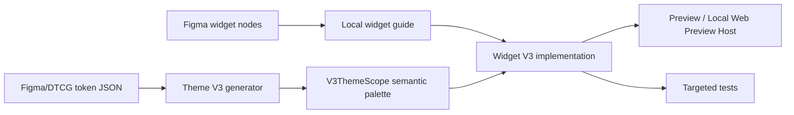

# Widget V3 Context

เอกสารนี้เป็น context กลางและจุดเริ่มต้นสำหรับผู้พัฒนาและ agent ที่สร้างหรือแก้ไข reusable widget ทุกตัวใต้ `lib/widgets/v3/` โดยมีเป้าหมายให้ widget เชื่อมกับ Theme V3, Figma, preview, tests และ metadata ด้วยรูปแบบเดียวกัน

> Theme dependency: ต้องอ่าน [`../../config/themes/v3/V3_THEME_GUIDELINE.mdx`](../../config/themes/v3/V3_THEME_GUIDELINE.mdx) ก่อนเลือกหรือเพิ่ม color token เอกสาร Theme V3 เป็น source of truth ด้าน token architecture, generation และ runtime color API ส่วนเอกสารนี้เป็น source of truth ด้านการประกอบ token เหล่านั้นเป็น Widget V3

> Design-system dependency: ต้องอ่าน [`../../../DESIGN.md`](../../../DESIGN.md) ก่อนกำหนด UI, API, state หรือ token mapping และยึดเป็น source of truth ด้าน design language, visual rules, component intent/variants, typography, spacing, radius และ effects ของ V3 ห้ามใช้ความเคยชินจาก legacy widget หรือเดาจากชื่อ token แทน reference นี้

## ขอบเขตและหลักการ

- Widget V3 เป็นระบบ additive และต้องไม่แก้หรือ migrate legacy widget โดยอัตโนมัติ
- source of truth ของ design-system rules คือ `DESIGN.md`; source of truth ของรายละเอียดเฉพาะ widget และ state คือ Figma node/spec ที่ระบุใน local guide
- source of truth ของสีคือ Theme V3 semantic tokens ไม่ใช่ HEX, primitive color หรือ legacy theme
- reusable widget รับ content และ callback ผ่าน constructor แบบ explicit; user-facing copy ต้องมาจาก caller เพื่อรองรับ localization
- ทุก widget ต้องรองรับ Light/Dark, accessibility, text scaling และ standalone preview (auto-discovered โดย `dart run tool/generate_v3_preview_registry.dart` ให้เปิดผ่าน local web preview host ได้)

## ลำดับการอ่านก่อนเริ่มงาน

1. อ่าน `AGENTS.md` และ `MEMORY.md` ที่ repo root
2. อ่าน [`DESIGN.md`](../../../DESIGN.md) โดยเฉพาะ Design Rules, tokens, typography, spacing, effects และ component variants ที่เกี่ยวข้อง
3. อ่าน [Theme V3 Architecture Guideline](../../config/themes/v3/V3_THEME_GUIDELINE.mdx)
4. อ่าน [`docs/v3/V3_WIDGET_CONVENTIONS.md`](../../../docs/v3/V3_WIDGET_CONVENTIONS.md)
5. อ่าน source, preview, guide และ tests ของ widget/category ที่ใกล้เคียง
6. ตรวจ semantic token ที่มีอยู่ใน `lib/config/themes/v3/tokens/semantic/` และ generated Dart properties
7. ตรวจ Figma node/spec ของทุก variant, size และ state ที่อยู่ใน scope

ห้ามเดา token จากชื่อสีหรือคัดลอก mapping จาก widget อื่นโดยไม่ตรวจ `DESIGN.md`, design source และ Light/Dark semantics หากทั้งสามแหล่งไม่ตรงกันให้บันทึก conflict และ reconcile ก่อน implement ห้าม hardcode ค่าเพื่อข้ามปัญหา

## โครงสร้างมาตรฐาน

```text
lib/widgets/v3/
├── V3_WIDGETS_CONTEXT.md
└── <category>/
    ├── v3_<widget>.dart
    ├── preview_v3_<widget>.dart
    └── V3_<WIDGET>_GUIDE.md

test/widgets/v3/<category>/
└── v3_<widget>_test.dart
```

- path และชื่อ public class ต้องมี `v3`/`V3` ชัดเจน
- แยก public enums/models ออกจาก implementation เมื่อขนาดหรือการ reuse เหมาะสม
- private helper widgets ควรมีหน้าที่เดียวและอยู่ในไฟล์หลักได้เมื่อใช้เฉพาะ component นั้น
- ห้าม import Theme V3 หรือ Widget V3 เข้า legacy widgets ใต้ `lib/widgets/` นอกโฟลเดอร์ `v3/`
- ห้ามแก้ `lib/preview_v3/preview_registry.g.dart` ด้วยมือ (generated output) — regenerate ด้วย `dart run tool/generate_v3_preview_registry.dart` แทน

## การเชื่อมกับ Theme V3

Widget ต้องอ่าน palette ตาม brightness ผ่าน public runtime API เท่านั้น:

```dart
import 'package:mcp_test_app/config/themes/v3/v3_theme_scope.dart';

@override
Widget build(BuildContext context) {
  final colors = V3ThemeScope.colorsOf(context);

  return DecoratedBox(
    decoration: BoxDecoration(color: colors.backgroundPrimary),
    child: Text(
      label,
      style: TextStyle(color: colors.contentPrimary),
    ),
  );
}
```

กฎบังคับ:

- ใช้ semantic properties จาก `V3ThemeScope.colorsOf(context)` สำหรับสีเชิงหน้าที่
- ห้าม import legacy `theme_color.dart`, เรียก `ThemeColors.get()` หรือ fallback ไป legacy theme
- ห้ามใช้ raw `Color(...)` หรือ primitive token โดยตรงเมื่อ semantic token รองรับ
- การใช้ `withValues(alpha: ...)` ต้องอิง semantic token ที่ถูกหน้าที่ และบันทึกเหตุผล/mapping ใน local guide
- ถ้า semantic token ที่ต้องการยังไม่มี ห้ามสร้างสีชั่วคราวใน widget ให้แก้ Light/Dark token sources ตาม workflow ใน Theme guideline แล้ว regenerate ก่อน
- ห้ามแก้ `lib/config/themes/v3/generated/**` ด้วยมือ

ความสัมพันธ์ของข้อมูล:



## Workflow การสร้าง Widget V3

### 1. กำหนด scope จาก Design

- ระบุกฎและ component reference ที่เกี่ยวข้องจาก `DESIGN.md`
- ระบุ Figma file, file key และ node IDs ที่ตรวจสอบได้
- สรุป variants, sizes, states, responsive behavior และ interaction ที่อยู่ใน scope
- บันทึกสิ่งที่ไม่อยู่ใน scope เพื่อป้องกัน API ขยายจากการคาดเดา

### 2. ทำ token mapping

- map สีแต่ละส่วน/state ไปยัง slash-separated semantic token path เช่น `content/primary`
- ตรวจ mapping ทั้ง Light และ Dark ผ่าน generated palette/preview
- หาก token ไม่พอ ให้ทำ Theme V3 token workflow ก่อนเริ่ม hardcode implementation
- บันทึก semantic tokens ทั้งหมดใน section `V3 Metadata` ของ local guide

### 3. ออกแบบ public API

- รับ content, localized labels, callbacks และ state ผ่าน constructor ที่ explicit
- ใช้ enum สำหรับชุด variant/state ที่ปิดและคาดเดาได้
- disabled/loading/error behavior ต้องชัดเจนและไม่เกิด callback ผิดสถานะ
- อย่าผูก reusable widget กับ app provider, navigation หรือ business logic โดยไม่จำเป็น
- ใช้ `const` และแบ่ง helper widgets ตามความเหมาะสม

### 4. Implement accessibility และ layout

- รองรับ keyboard/focus และ semantics สำหรับ interactive widget
- touch target ควรมีพื้นที่อย่างน้อย 48×48 logical pixels; หาก visual spec เล็กกว่าให้ระบุ integration requirement ใน guide
- icon-only action ต้องรับ localized semantic label จาก caller
- ตรวจ text scaling, overflow, RTL/locale implications และ contrast ใน Light/Dark
- state ต้องไม่สื่อด้วยสีหรือ animation เพียงอย่างเดียว

### 5. สร้าง preview

- standalone preview ต้องรันได้ด้วย `flutter run -t lib/widgets/v3/<category>/preview_v3_<widget>.dart`
- ต้องมี Light/Dark toggle ที่ทำให้ widget ทั้งหมดอ่าน palette ของ mode ที่เลือกจริง
- แสดง matrix ของ variants/states สำคัญ รวมถึง disabled, loading และ error เมื่อเกี่ยวข้อง
- ตั้งชื่อไฟล์และ class ตาม convention (`preview_v3_<widget>.dart` มี `class V3<Widget>Preview`) แล้วรัน `dart run tool/generate_v3_preview_registry.dart` เพื่อ regenerate `lib/preview_v3/preview_registry.g.dart` โดยอัตโนมัติ (ไม่ต้องแก้ registry ด้วยมือ) เพื่อให้เปิดผ่าน `./scripts/serve-v3-preview.sh` ได้

### 6. เขียน targeted tests

อย่างน้อยให้พิจารณาครอบคลุม:

- semantic token mapping ใน Light และ Dark
- metrics/variants/states ที่สำคัญตาม Figma
- callback, disabled และ loading behavior
- semantics, focus/keyboard และ localized labels
- text scaling/overflow
- preview theme switching

### 7. เขียน local guide

ไฟล์ `V3_<WIDGET>_GUIDE.md` ต้องมี:

- component purpose และ scope
- Figma source-of-truth links/node IDs
- usage example
- public API table
- variant/state/size behavior และ token mapping ที่มีข้อสังเกต
- accessibility/integration notes
- preview command
- `V3 Metadata` block

ตัวอย่าง metadata ขั้นต่ำ:

```yaml
Theme system: V3
Widget: V3Example
Category: example
Source: lib/widgets/v3/example/v3_example.dart
Preview: lib/widgets/v3/example/preview_v3_example.dart
Test: test/widgets/v3/example/v3_example_test.dart
Design source: Figma
Figma file: <file name>
Figma file key: <file key>
Figma nodes:
  - "<node id>"
Semantic tokens:
  - content/primary
  - background/primary
```

ใช้ token path จาก source catalog แบบ slash-separated เพื่อให้เอกสาร, schema และ MCP metadata อ่านตรงกัน

## Verification ก่อนส่งงาน

เริ่มจาก targeted checks แล้วค่อยขยายตามผลกระทบ:

```bash
flutter test test/widgets/v3/<category>/v3_<widget>_test.dart
npm run check:v3-boundaries
flutter analyze
```

เมื่อแตะ Theme V3 token/generator ให้ทำตาม verification ใน Theme guideline และเพิ่ม:

```bash
dart run lib/config/themes/v3/v3_theme_generator.dart
flutter test test/config/themes/v3
flutter test test/widgets/v3
```

เมื่อเพิ่มหรือแก้ preview file ใหม่ใต้ `lib/widgets/v3/`:

```bash
dart run tool/generate_v3_preview_registry.dart
flutter test test/preview_v3/ test/tool/
flutter build web --release -t lib/preview_v3/main.dart
```

เมื่อ local widget guide ส่งผลต่อ schema downstream:

```bash
npm run generate-schema
```

เปิด standalone preview ตรวจ Light/Dark และ interaction จริงด้วยเสมอเมื่อสภาพแวดล้อมรองรับ

## Definition of Done

- implementation อยู่ใน `lib/widgets/v3/<category>/` และไม่มี legacy theme dependency
- behavior, visual rules และ component semantics สอดคล้องกับ `DESIGN.md` หรือมี conflict resolution ที่บันทึกไว้
- Figma scope/node IDs และ semantic token mapping ถูกบันทึกใน local guide
- สีทั้งหมดมาจาก `V3ThemeScope.colorsOf(context)` หรือมีข้อยกเว้นที่อธิบายและตรวจสอบแล้ว
- preview ครอบคลุม Light/Dark และ states สำคัญ
- targeted tests ผ่านและครอบคลุม behavior/accessibility ที่เหมาะสม
- boundary check และ analyzer ผ่าน
- generated artifacts ถูก regenerate จาก source เท่านั้น
- เอกสาร/API/metadata สอดคล้องกับ implementation จริง

## ตัวอย่างอ้างอิงใน Repo

Widget pilot ที่ใช้เป็น reference ได้คือ `V3MiniButton`:

- implementation: [`button/v3_mini_button.dart`](button/v3_mini_button.dart)
- preview: [`button/preview_v3_mini_button.dart`](button/preview_v3_mini_button.dart)
- local guide: [`button/V3_MINI_BUTTON_GUIDE.md`](button/V3_MINI_BUTTON_GUIDE.md)
- test: `test/widgets/v3/button/v3_mini_button_test.dart`

ใช้ pilot เพื่อดูรูปแบบไฟล์และ test strategy แต่ต้องยึด Figma spec และ semantic mapping ของ widget ใหม่เป็นหลัก
